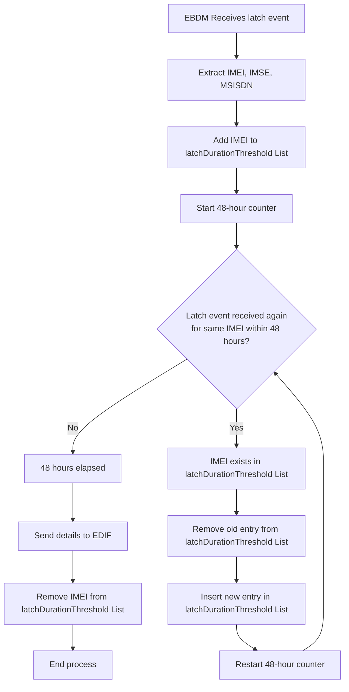
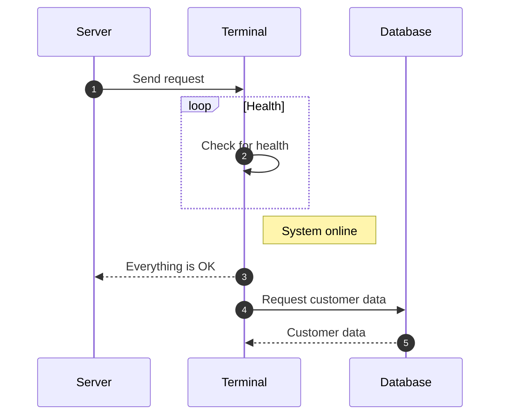
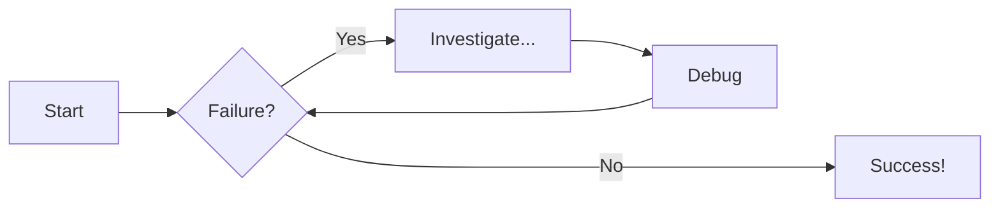

# Diagram Examples

```mermaid

flowchart TD

A[EBDM Receives latch event]:::startEnd --> 
B[Extract IMEI, IMSE, MSISDN]:::process -->
C[Add IMEI to latchDurationThreshold List]:::process --> 
D[Start 48-hour counter]
D --> E{Latch event received again<br>for same IMEI within 48 hours?}:::decision
E -- "No" --> F[48 hours elapsed]:::block2
F --> G[Send details to EDIF]:::block2
G --> H[Remove IMEI from latchDurationThreshold List]:::block2
H --> I[End process]:::startEnd
E -- "Yes" --> J[IMEI exists in latchDurationThreshold List]:::block3
J --> K[Remove old entry from latchDurationThreshold List]:::block3
K --> L[Insert new entry in latchDurationThreshold List]:::block3
L --> M[Restart 48-hour counter]:::block3
M --> E
```
---

## Sequence Diagrams

```mermaid
sequenceDiagram
  autonumber
  Server->>Terminal: Send request
  loop Health
      Terminal->>Terminal: Check for health
  end
  Note right of Terminal: System online
  Terminal-->>Server: Everything is OK
  Terminal->>Database: Request customer data
  Database-->>Terminal: Customer data
```

---

# graph LR

```mermaid
graph LR
  A[Start] --> B{Failure?};
  B -->|Yes| C[Investigate...];
  C --> D[Debug];
  D --> B;
  B ---->|No| E[Success!];

```
